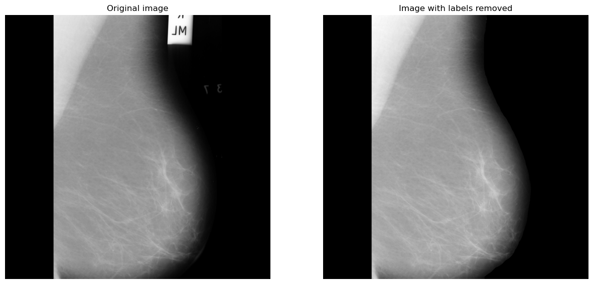
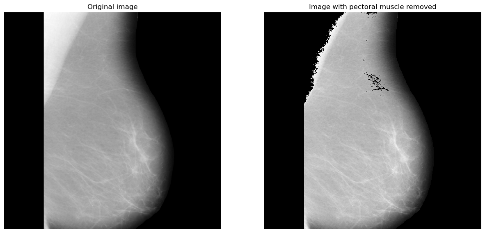
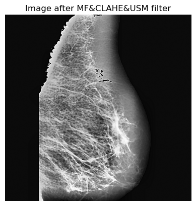

<h1 align="center">Breast Cancer Detection using different filtering methods</h1>

  

    <a href="#introduction">Introduction</a> •
    <a href="#method">Method</a> •
    <a href="#discussion">Discussion</a> •
    <a href="#conclusion">Conclusion</a>

## Introduction

Breast cancer detection remains a significant challenge in the medical field. Traditionally, an expert is required to analyze mammography images to determine whether a patient may be at risk of breast cancer. However, with advancements in Machine Learning (ML) and Computer Vision, we can now develop models that automatically detect breast cancer patterns.

This project focuses on benchmarking the performance of breast cancer detection models using various image filtering techniques. The goal is to identify the optimal combination of features that enhances model performance for detecting breast cancer.

The paper used for this study is : [A Novel Medical Image Enhancement Algorithm for Breast](Docs/A%20Novel%20Medical%20Image%20Enhancement%20Algorithm%20for%20Breast.pdf).

## Method

The dataset used for this project consists of black-and-white mammography images from the [mini-BIAS dataset](http://peipa.essex.ac.uk/info/mias.html), containing 322 images with a resolution of 1024x1024 pixels. For this study, only the class of abnormality is used.

### Preprocessing Steps

The preprocessing pipeline involves several key steps to prepare the data for machine learning:

1. **Removing Labels:** 
   The labels on mammography images (such as left or right breast) are removed using morphological operations like erosion and dilation.

  

2. **Removing the Pectoral Muscle:**
   The pectoral muscle is removed using a combination of Contrast-Limited Adaptive Histogram Equalization (CLAHE) and K-Means clustering to create a mask, isolating the breast tissue.

  

3. **Applying Filters:**
   Various filters are applied to improve image quality:
   - **Median Filter:** Used for noise reduction while preserving edges.
   - **CLAHE:** Enhances local contrast, especially in low-light areas.
   - **Unsharp Masking:** Sharpens edges and enhances details in the image.

  

4. **Feature Extraction:**
   The Gray Level Co-occurrence Matrix (GLCM) and Gray Level Run Length Matrix (GLRLM) are used to extract important image features for machine learning models. Nine variables such as contrast, entropy, and autocorrelation are computed.

5. **Machine Learning Model:**
   A Random Forest model is used to classify the images as normal or abnormal based on the extracted features. The model is optimized using Optuna for hyperparameter tuning and evaluated using several metrics including accuracy, sensitivity, specificity, and AUC. The performances are presented in the Table above.

| **Filter(s)**         | **Accuracy** | **Sensitivity (Recall)** | **PPV (Precision)** | **F1-score** | **AUC** |
|-----------------------|--------------|--------------------------|---------------------|--------------|---------|
| CLAHE                 | 0.598        | 0.905                    | 0.633               | 0.745        | 0.467   |
| MF&CLAHE              | 0.608        | 0.937                    | 0.634               | 0.756        | 0.468   |
| MF&CLAHE&USM          | 0.649        | 0.841                    | 0.688               | 0.757        | 0.568   |

### Applying on New Data

The approach is tested on the [DDSM Mammography Database](https://www.kaggle.com/datasets/skooch/ddsm-mammography/data) from Kaggle, which contains images of lower resolution (299x299 pixels). While label and pectoral muscle removal were not necessary for this dataset, the same filter combinations were applied to evaluate model performance.

## Discussion

The combination of filters has shown to improve model performance in breast cancer detection, particularly with the MF+CLAHE+USM combination. However, results can vary depending on the dataset and the specific filter parameters used. While the method enhances image details, further investigation is needed into the impact of different breast tissue types, mammography resolution, and parameter settings.

This study presents a novel way of preprocessing mammography images using a combination of multiple filters, which has not been widely explored in previous studies.

## Conclusion

Combining multiple filtering techniques (MF+CLAHE+USM) can enhance model performance in breast cancer detection. However, the replicability of these results may vary with different datasets and filter parameters. This approach opens new possibilities for improving image quality in medical image processing and could potentially be applied to broader fields in the future.

To see the complete report click on this link : [Breast Cancer detection using different filtering methods](Docs/OVO%20-%20Breast%20Cancer%20detection%20using%20different%20filtering%20methods%20-%20POULET%20Lancelin.pdf)

